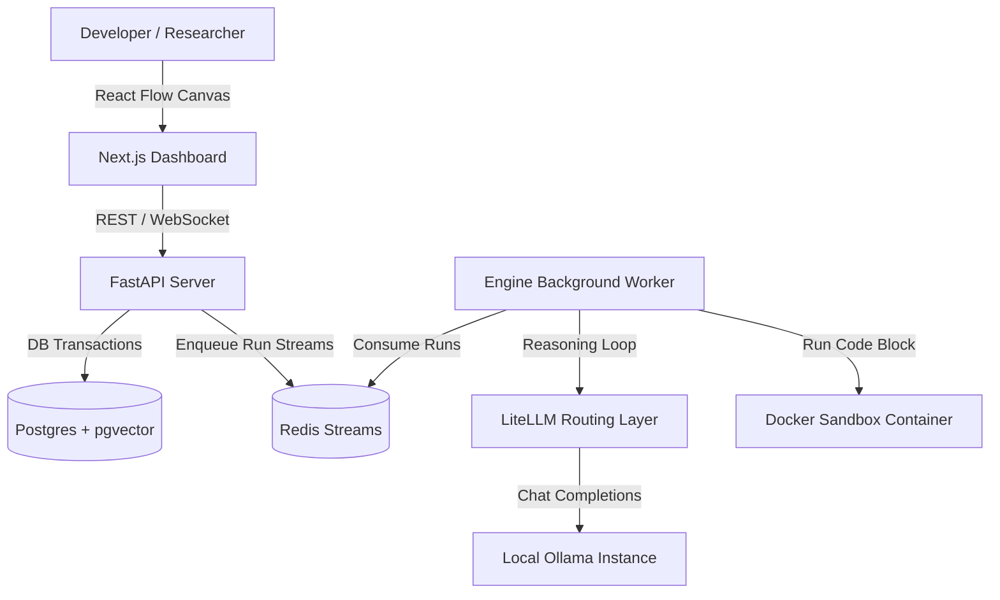

# AgentCraft 🚀

AgentCraft is an enterprise-grade, education-friendly **Agentic AI Platform** built with **FastAPI**, **Next.js 15 (React 19)**, **PostgreSQL with pgvector**, and **Docker sandboxing**. It allows developers, researchers, and organizations to design, execute, debug, and monitor complex cyclic agent workflows using local LLM models powered by **Ollama**.

---

## Key Features

1. **State Machine Orchestrator:** Implements fully cyclic transition graphs (loops) with Pydantic state persistence, conditional branching, and automatic edge routing.
2. **Dual-Memory Layer:** Episodic traces, semantic RAG chunks, and rule-based profile memories stored using `pgvector` HNSW cosine similarity.
3. **Trace Debugger:** Step-by-step state diffing, prompt inspections, tool output capture, and real-time streaming over WebSockets.
4. **Human-in-the-Loop (HITL):** Mid-execution approval gates and state steering directly from the trace inspector interface.
5. **Secure Docker Sandbox:** Programmatic Python and Node.js code execution with memory/CPU caps and network isolation.
6. **Local Ollama Integration:** Out of the box support for running open-source models like `llama3.2` and `nomic-embed-text`.

---

## Architecture Diagram



---

## Quick Start (Docker Compose)

### 1. Prerequisites
- Docker & Docker Compose installed.
- Ollama installed locally (for local models execution).

### 2. Prepare Local LLM Models
Ensure Ollama is running and download the default reasoning and embedding models:
```bash
ollama pull llama3.2
ollama pull nomic-embed-text
```

### 3. Clone & Startup Platform
Configure your environment using the template:
```bash
cp .env.example .env
```

Spin up the entire stack using Docker Compose:
```bash
docker-compose up --build -d
```

Once initialized:
- **Frontend Dashboard:** [http://localhost:3000](http://localhost:3000)
- **FastAPI API Docs:** [http://localhost:8000/docs](http://localhost:8000/docs)

---

## System Configurations

| Variable | Default Value | Description |
|---|---|---|
| `DATABASE_URL` | `postgresql+asyncpg://...` | Connection URI for Postgres DB |
| `REDIS_URL` | `redis://...` | Redis cache and queue connection |
| `OLLAMA_BASE_URL` | `http://localhost:11434` | Endpoint of the Ollama server |
| `DEFAULT_LLM_MODEL` | `llama3.2` | Primary agent reasoning model |
| `EMBEDDING_MODEL` | `nomic-embed-text` | Vectorization model (768 dimensions) |
| `ENCRYPTION_KEY` | `enc-key-32bytes-must-be-secure` | Key to encrypt custom tool secrets |

---

## Creating Your First Workflow

1. Open the dashboard at [http://localhost:3000](http://localhost:3000).
2. Go to **Agents** and deploy an agent persona (e.g. name: `Llama Assistant`, select model `llama3.2`).
3. Navigate to **Workflows**, click **Draw Workflow**, name your pipeline, and click **Start Drawing**.
4. Drag or click the side blocks to add an **Agent Node** and a **Tool Node** (e.g., `web_search`). Connect them:
   `Start -> Agent Node -> Tool Node -> End`
5. Click **Run Pipeline** to launch the execution trace. Follow step-by-step reasoning outputs and WebSocket events in the debugger!
